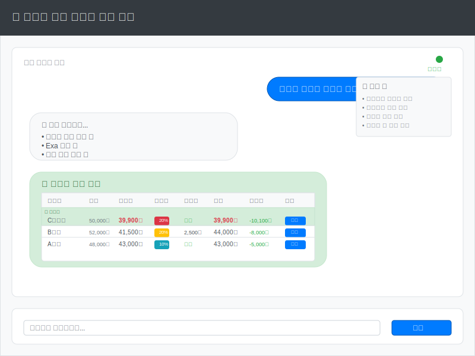

# UX 와이어프레임

## 데스크톱 인터페이스

### 메인 채팅 인터페이스

**주요 구성 요소:**
- **헤더**: 서비스 제목과 브랜딩
- **채팅 영역**: 사용자와 봇 간의 대화 표시
- **메시지 버블**: 사용자(우측 파란색), 봇(좌측 회색/녹색)
- **가격 비교 테이블**: 쇼핑몰별 원가, 할인가, 할인율, 배송비, 총액, 절약액, 구매 링크
- **입력 영역**: 메시지 입력창과 전송 버튼
- **상태 표시**: 온라인 상태 및 사용 팁

**기능적 특징:**
- SSE 스트리밍으로 실시간 검색 진행 상황 표시
- 총액(할인가+배송비)별 정렬된 결과 테이블
- 할인율 및 배송비 구분 표시
- 직접 구매 링크 제공
